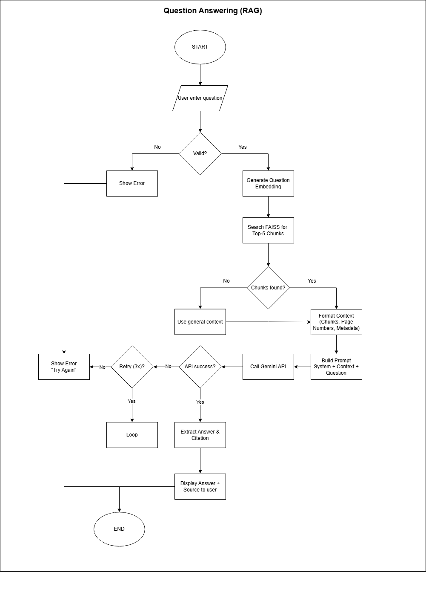

<div align="center">

# 📄 Ask Your PDF
**AI-Powered PDF Question Answering System**

[](https://www.python.org/) [](https://fastapi.tiangolo.com/) [](https://streamlit.io/) [](LICENSE) []()

*Upload your PDF, ask questions, get intelligent answers powered by AI*
[Features](#-features) • [Architecture](#-architecture) • [Tech Stack](#-tech-stack) • [Quick Start](#-quick-start) • [Roadmap](#-roadmap)
</div>

---

## 📋 **Overview**

Ask Your PDF is a Retrieval-Augmented Generation (RAG) based system that allows users to upload PDF documents and ask questions about their content. The system uses advanced AI models (Gemini/OpenAI) to understand context and provide accurate, source-grounded answers.

### **🎯 Key Highlights**
- 🤖 **Multi-LLM Support**: Seamlessly switch between Gemini (primary) and OpenAI (fallback)
- ⚡ **Lightning Fast**: FAISS vector store optimized for speed and minimal memory
- 🎨 **User-Friendly**: Clean Streamlit interface for easy interaction
- 🔒 **Lightweight**: Optimized for Hugging Face Spaces deployment
- 📦 **Production-Ready**: Comprehensive testing, logging, and error handling

---

## ✨ **Features**

### **Current Features** ✅
- [x] PDF Upload and parsing
- [x] Intelligent text chunking with overlap
- [x] Vector embeddings (Gemini and OpenAI)
- [x] FAISS-based similarity search
- [x] Context-aware question answering
- [x] Session management with auto-cleanup
- [x] Comprehensive logging system
- [x] RESTful API with FastAPI
- [x] Interactive web UI with Streamlit

### **Planned Features** 🔜
- [ ] Multi-file upload support
- [ ] Conversation history & follow-up questions
- [ ] Source citation with page numbers
- [ ] Export chat history (PDF/TXT)
- [ ] Custom Prompt templates
- [ ] Advanced filtering & search
- [ ] User feedback mechanism
- [ ] Multi-language support

---

## 🏗️ **Architecture**

### **System Architecture**

<div align="center">
  
  
</div>

### **Workflow Diagram**

*End-to-end workflow from PDF upload to answer generation*

### **Component Breakdown**


---

## 🛠️ **Tech Stack**

### **Backend**

| Technology | Version | Purpose |
|------------|---------|---------|
| **FastAPI** | 0.109.0 | High-performance web framework |
| **Python** | 3.10+ | Core programming language |
| **FAISS** | 1.7.4 | Vector similarity search (CPU-optimized) |
| **Google Generative AI** | 0.3.2 | Primary LLM (Gemini Pro) |
| **OpenAI** | 1.10.0 | Fallback LLM (GPT-3.5/4) |
| **PyPDF** | 3.17.4 | PDF parsing and text extraction |
| **Pydantic** | 2.5.3 | Data validation and settings |
| **Uvicorn** | 0.27.0 | ASGI server |

### **Frontend**

| Technology | Version | Purpose |
|------------|---------|---------|
| **Streamlit** | 1.30.0 | Interactive web UI |
| **Requests** | 2.31.0 | HTTP client for API calls |

### **DevOps & Tools**

| Technology | Version | Purpose |
|------------|---------|---------|
| **Docker** | - | Containerization |
| **Pytest** | 7.4.4 | Testing framework |
| **Black** | 24.1.1 | Code formatting |
| **Flake8** | 7.0.0 | Linting |
| **Git** | - | Version control |

---

## 📁 **Project Structure**
```
ask-ur-pdf/
├── backend/                    # FastAPI backend
│   ├── app/
│   │   ├── api/               # API routes & handlers
│   │   ├── config/            # Configuration files
│   │   ├── core/              # Core functionality (logging, exceptions)
│   │   │   ├── services/          # Business logic
│   │   │   │   ├── llm/           # LLM clients (Gemini, OpenAI, Factory)
│   │   │   │   ├── processing/    # Text processing (chunking, tokenization)
│   │   │   │   ├── rag/           # RAG pipeline (embeddings, retrieval)
│   │   │   │   └── inference/     # Inference orchestration
│   │   ├── schemas/           # Pydantic models (API)
│   │   ├── models/            # Domain models
│   │   ├── prompts/           # Prompt templates
│   │   └── utils/             # Helper functions
│   ├── tests/                 # Unit & integration tests
│   ├── config/                # YAML configurations
│   ├── data/                  # Runtime data (gitignored)
│   ├── logs/                  # Application logs (gitignored)
│   └── requirements.txt       # Python dependencies
│
├── frontend/                   # Streamlit frontend
│   ├── pages/                 # Multi-page app
│   ├── components/            # Reusable UI components
│   ├── utils/                 # Frontend utilities
│   └── requirements.txt       # Frontend dependencies
│
├── scripts/                    # Automation scripts
├── docs/                      # Documentation & diagrams
│   └── images/                # Architecture diagrams
├── .gitignore
├── docker-compose.yml
└── README.md
```

---

## 🚀 **Quick Start**

### **Prerequisites**

- Python 3.10 or higher
- Git
- Docker & Docker Compose (Optional)

### **Installation**

#### **1. Clone Repository**
```bash
git clone https://github.com/febiansyahnfl/ask-ur-pdf.git
cd ask-ur-pdf
```

#### **2. Setup Application**
```bash

# Create virtual environment
python -m venv venv

# Activate virtual environment
# On Windows:
venv\Scripts\activate
# On Mac/Linux:
source venv/bin/activate

# Install dependencies
pip install -r requirements.txt

# Setup environment variables
cp .env.example .env
# Edit .env and add your API keys:
# - Gemini_API_KEY=yuor_gemini_api_key
# - OPENAI_API_KEY= your_openai_api_key
```

#### **3. Run Application**

**Terminal 1 - Backend:**
```bash
cd backend
uvicorn app.main:app --reload
```

**Terminal 2 - Frontend:**
```bash
cd frontend
streamlit run Home.py
```

**Access:**
- Frontend: http://localhost:8501
- Backend API: http://localhost:8000
- API docs: http://localhost:8000/docs

---

## 🐳 **Docker Deployment**
```bash
# Build and run with Docker Compose
docker-compose up --build

# Access
# Frontend: http://localhost:8501
# Backend: http://localhost:8000
```

---

## ⚙️ **Configuration**

### **Environment Variables (.env)**
```env
# API Keys
GEMINI_API_KEY=your_gemini_api_key_here
OPENAI_API_KEY=your_openai_api_key_here

# LLM Configuration
LLM_PROVIDER=gemini     # Options: gemini, openai

# Application Settings
APP_NAME=Ask Your PDF
APP_VERSION=1.0.0
DEBUG=True

# Session Configuration
SESSION_LIFETIME_HOURS=2
MAX_FILE_SIZE_MB=10

# Vector Store
VECTOR_STORE_TYPE=faiss

# Server
BACKEND_HOST=0.0.0.0
BACKEND_PORT=8000
FRONTEND_URL=http://localhost:8501
```

## 📝 **License**

This project is licensed under the MIT License - see the [LICENSE](LICENSE) file for details.

---

## 👤 **Author**

**Syahrul Gunawan Ramdhani**
- Github: [@syagura](https://github.com/syagura)
- LinkedIn: [Syahrul Gunawan Ramdhani](www.linkedin.com/in/syahrulgunawanramdhani)
- Email: syahrulgunawanramdhani@gmail.com

**Febiansyah Annaufal Ahnaf Fauzi**
- GitHub: [@febiansyahnfl](https://github.com/febiansyahnfl)
- LinkedIn: [Febiansyah Annaufal Ahnaf Fauzi](https://www.linkedin.com/in/febiansyah-naufal/)
- Email: febiansyah84@gmail.com

---

## 🙏 **Acknowledgments**

- [FastAPI](https://fastapi.tiangolo.com/) - Modern web framework
- [Streamlit](https://streamlit.io/) - Easy-to-use UI framework
- [FAISS](https://github.com/facebookresearch/faiss) - Efficient similarity search
- [Google Gemini](https://ai.google.dev/) - Powerful AI capabilities
- [OpenAI](https://openai.com/) - GPT models
- Inspired by [LangChain](https://langchain.com/) RAG patterns

---

## 📈 **Project Status**

   

---

<div align="center">

**Made with ❤️ from Indonesia**

⭐ Star this repo if you find it helpful!

</div>